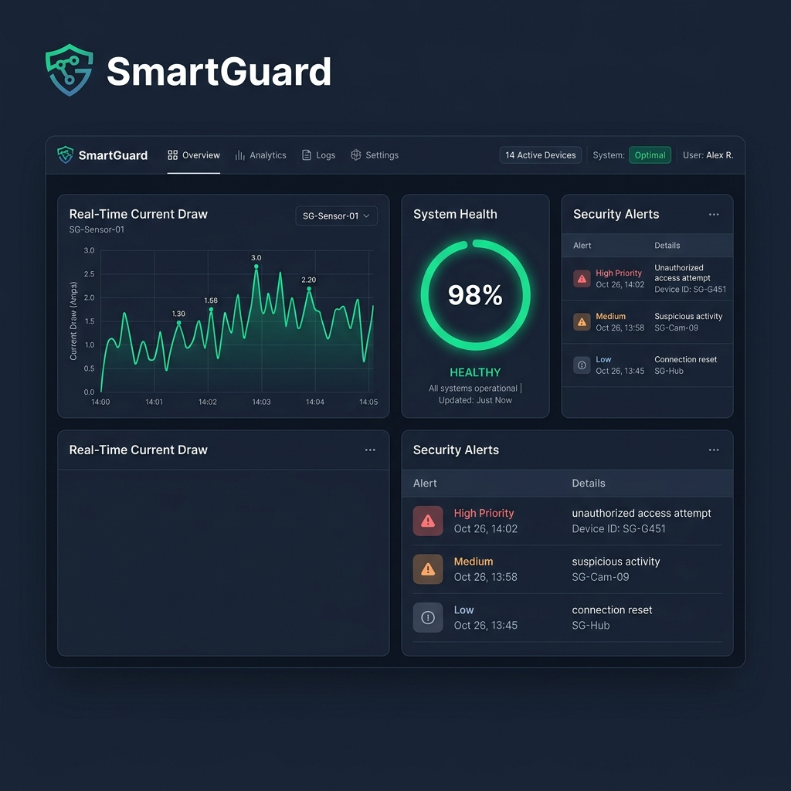

# 🛡️ SmartGuard: AIoT Appliance Health Monitor



**SmartGuard** is an end-to-end AIoT (Artificial Intelligence of Things) system designed to monitor the "health" of electrical appliances in real-time. By combining Edge AI classification, cloud synchronization via Firebase, and a sleek web dashboard, SmartGuard detects anomalies like bearing wear, electrical surges, and physical tampering before they lead to appliance failure.

## 🚀 Key Features

- **Edge AI Classification**: Runs a TinyML-inspired classifier (modeled after Edge Impulse) directly on the ESP32 to categorize appliance state: `Healthy`, `Warning`, `Critical`, or `TAMPER`.
- **Real-Time Dashboard**: A high-performance web interface built with Vanilla JS and Chart.js featuring:
  - Live current draw visualization (Amps).
  - Dynamic health confidence rings.
  - Anomaly alert history feed.
  - "Demo Mode" for testing without hardware.
- **Firebase Integration**: Bi-directional data flow using Firebase Realtime Database for persistent logging and remote device status monitoring.
- **Hardware Security**: Integrated tamper detection that triggers a "Device Lockout" state locally and globally.
- **Hardware Simulation**: Full support for [Wokwi](https://wokwi.com) simulation, allowing development without physical components.

## 🏗️ Architecture

1.  **Firmware (ESP32)**: Written in C++ (Arduino), handles sensor sampling (Current, Acoustic, Tamper) and pushes classification results to Firebase via REST API.
2.  **Cloud (Firebase)**: Acts as the central hub for real-time state management and alert propagation.
3.  **Frontend (Web Dashboard)**: Responsive HTML/CSS/JS dashboard that consumes Firebase data and provides an intuitive operator interface.

## 🛠️ Project Structure

```text
├── dashboard/             # Web application (HTML, CSS, JS)
├── firmware/              # ESP32 Arduino source code
├── firebase/              # Database rules and setup guide
├── wokwi/                 # Wokwi simulation configuration
└── hardware_simulator.js  # Node.js based hardware simulation script
```

## 🚦 Quick Start

### 1. Hardware Simulation (Wokwi)
- Open the `wokwi/diagram.json` file in the Wokwi editor.
- Connect to the `Wokwi-GUEST` WiFi (no password).
- Monitor the serial output to see real-time classification.

### 2. Dashboard Setup
- Open `dashboard/index.html` in any modern browser.
- By default, it runs in **Demo Mode** with synthetic data.
- To connect your hardware:
  1. Enter your Firebase Project ID.
  2. Click **Connect**.

### 3. Firmware Configuration
- Open `firmware/smartguard_firmware.ino`.
- Update `FIREBASE_HOST` with your Firebase database URL.
- (Optional) Add your `FIREBASE_AUTH` secret if using database rules.

## 🧪 Research Basis
This project is inspired by modern AIoT research, including:
- *ML-based failure classification in smart plugs* (Hoang et al., 2026).
- *Energy-aware AIoT frameworks using Mixture-of-Experts* (MDPI, 2025).

## 📄 License
This project is open-source and available under the [MIT License](LICENSE).
